# FINAL PROJECT REPORT: SIMPLE LMS

## Identitas
- **Nama**: Abhirama Maulana Putra
- **NIM**: (A11.2023.15353)
- **Kelas**: (A11.4618)
- **URL Repository**: (https://github.com/abhi23455/Final-ProjectPSS.git)

---

## Deskripsi Project
Simple LMS adalah sistem manajemen pembelajaran sederhana berbasis Django dan Django Ninja. Backend dibangun sebagai REST API dengan fitur utama: manajemen user (admin/instructor/student), course & lesson, enrollment, progress tracking, caching Redis untuk performa, logging/analytics ke MongoDB, dan pemrosesan background menggunakan Celery + RabbitMQ. Aplikasi dikontainerkan menggunakan Docker Compose untuk kemudahan deploy dan testing.

---

## Fitur Dasar yang Sudah Berjalan
| No | Fitur | Status |
|----|-------|--------|
| 1 | Docker & Docker Compose | ✅ |
| 2 | Database PostgreSQL & Migration | ✅ |
| 3 | Custom User Model (admin, instructor, student) | ✅ |
| 4 | JWT Authentication (Register, Login, Refresh Token) | ✅ |
| 5 | Role-Based Access Control (RBAC) | ✅ |
| 6 | Course, Lesson, Enrollment, Progress API | ✅ |
| 7 | Swagger/OpenAPI Documentation | ✅ |
| 8 | Django Admin Panel | ✅ |

---

## Fitur Tambahan yang Dipilih 4,5,6 dan tambahan certificate
| No | Fitur | Kategori |
|----|-------|----------|
| 1 | Redis Caching (Course List & Detail) | Performance |
| 2 | Cache Invalidation Strategy | Performance | 
| 3 | Optimasi Query & N+1 Fixing | Performance |
| 4 | API Rate Limiting (Redis) | Security/Performance | 
| 5 | Activity Logging ke MongoDB | Analytics |
| 6 | Learning Analytics Collection | Analytics |
| 7 | Course Analytics Report (MongoDB Aggregation) | Analytics | 
| 8 | Async Email Notification (Celery) | Async | 
| 9 | Scheduled Task (Celery Beat) | Async |
| 10 | Flower Monitoring | Async | 
| 11 | Certificates GET API (bisa otomatis download dan masuk ke folder)|

(maks dihitung 50 poin)

---

## Penjelasan Implementasi Fitur Tambahan Utama

### 1. Redis Caching
- **Pola**: Cache-Aside (Lazy Loading) untuk read, Write-Through (Invalidation) untuk write
- **Cache Key**: `simple_lms:courses_list:{filters}` dan `simple_lms:course_detail:{id}`
- **TTL**: 5 menit untuk list course, 5 menit untuk detail
- **Invalidasi**: Cache otomatis dihapus saat course dibuat, diupdate, atau dihapus

### 2. MongoDB Activity & Analytics
- **Koleksi**: `ActivityLog` (catat login, enroll, complete lesson) dan `LearningAnalytics`
- **Aggregation**: Pipeline MongoDB untuk laporan statistik course

### 3. Celery & RabbitMQ Async Task
- **Task**: `send_enrollment_email`, `generate_certificate`, `update_course_statistics`, `export_course_report`
- **Monitoring**: Flower di `http://localhost:5555`

### 4. Optimasi Query & N+1 Fixing
- Manager `for_listing()` di `courses/models.py` menggunakan `select_related('instructor','category')` dan `annotate(enrollment_count=...)` sehingga mengurangi query berlebih pada list/detail.

---

## Cara Menjalankan Project
1. Pastikan Docker & Docker Compose terinstal.
2. Build & jalankan semua layanan:
```bash
docker compose up -d --build
```
3. Terapkan migrasi:
```bash
docker compose exec web python manage.py migrate --noinput
```
4. (Opsional) Buat akun demo dan data demo:
```bash
docker compose exec web python create_demo_accounts.py
docker compose exec web python create_demo_course.py
```
5. Jalankan skrip pengujian lokal (contoh):
```bash
docker compose exec web python test_api.py
```
6. URL akses:
- Swagger (OpenAPI): http://localhost:8000/api/docs
- Django Admin: http://localhost:8000/admin
- Flower (Celery monitor): http://localhost:5555
- RabbitMQ : http://localhost:15672/

---

## Akun Demo
| Role | Username | Password |
|------|----------|----------|
| Admin | admin_demo | admin123 |
| Instructor | instruktur_demo | instruktur123 |
| Student | siswa_demo | siswa123 |

---

## Endpoint Penting
| Metode | Path | Deskripsi | Auth |
|-------:|------|-----------|:----:|
| POST | `/api/auth/register` | Registrasi user baru | Public |
| POST | `/api/auth/login` | Login (JSON body: username/password) | Public |
| GET  | `/api/auth/me` | Info user saat ini | JWT (Bearer) |
| GET  | `/api/courses/` | Daftar course (filter/sort/paginate) | Public |
| GET  | `/api/courses/{id}` | Detail course | Public |
| POST | `/api/courses/` | Buat course baru | Instructor |
| POST | `/api/enrollments/` | Enroll ke course | Student (JWT) |
| GET  | `/api/enrollments/my-courses` | Daftar course user ikut | Student (JWT) |
| GET  | `/api/analytics/logs/user/{user_id}` | Activity logs (MongoDB) | Admin |
| GET  | `/api/analytics/stats/course/{course_id}` | Course analytics (Mongo) | Instructor/Admin |
| GET  | `/api/certificates/download/{cert_id}` | download Certificate (harus sudah enroll, lalu di generate dan execute my certificate untuk mendapatkan id lalu execute untuk download di {cert_id})
      
---

## Screenshot / Bukti Pengujian
- 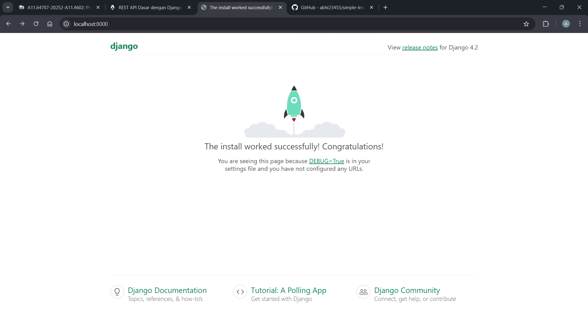

- 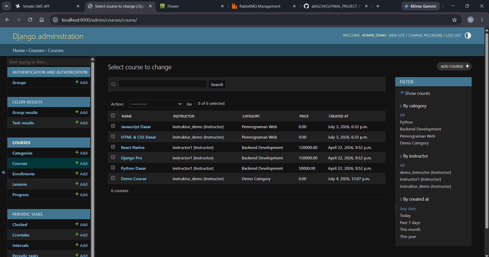

- 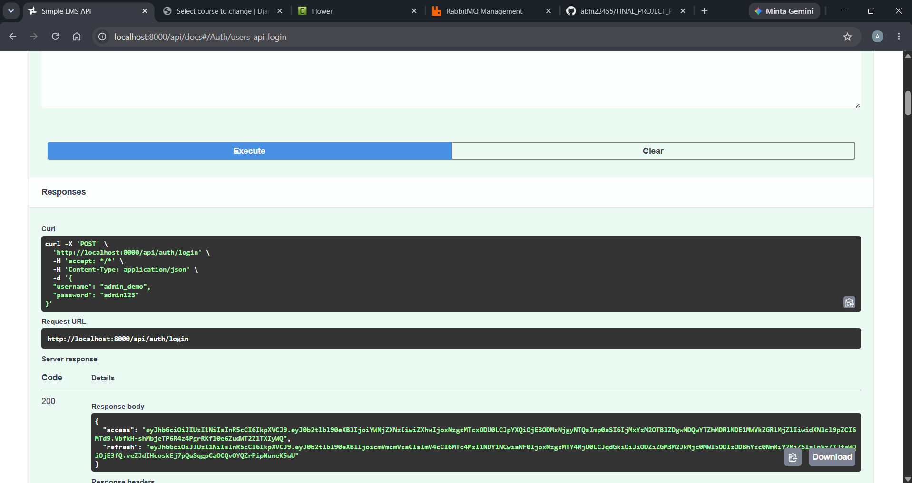

- 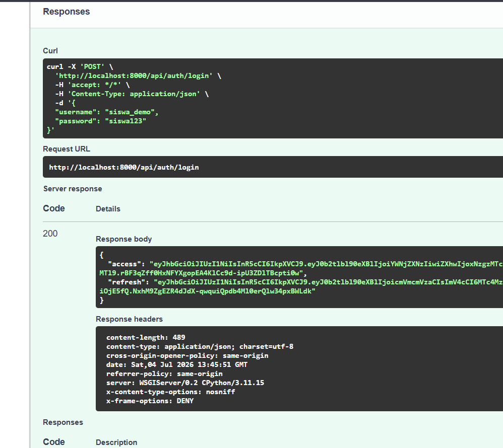

- 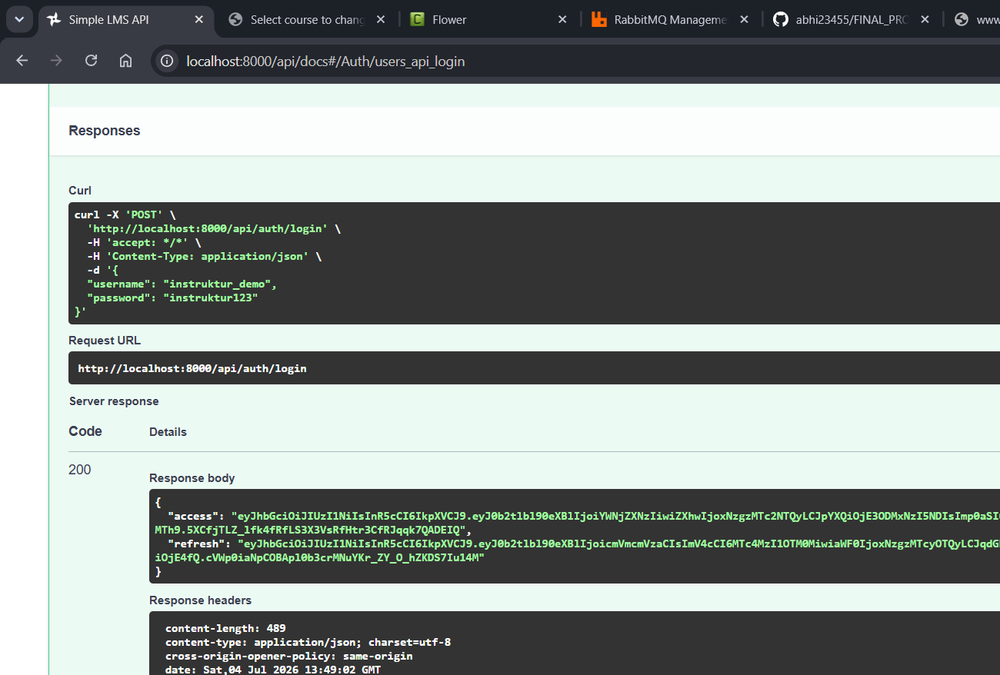

- 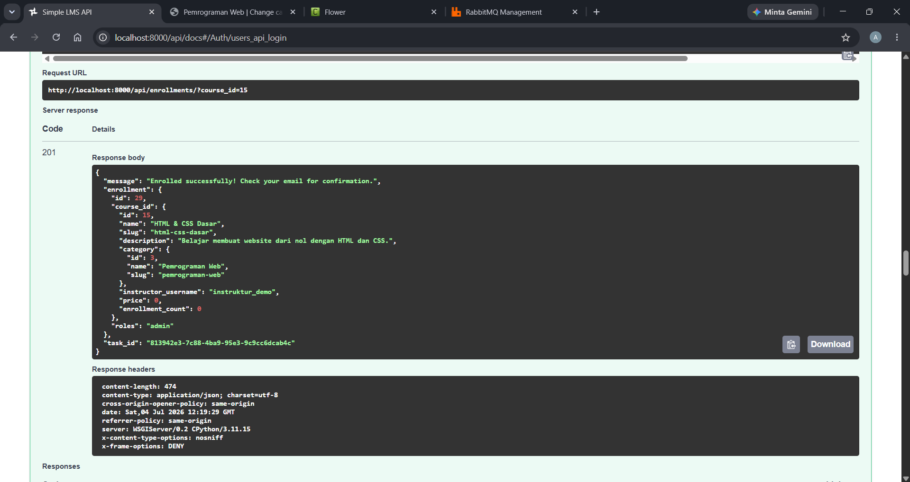

- 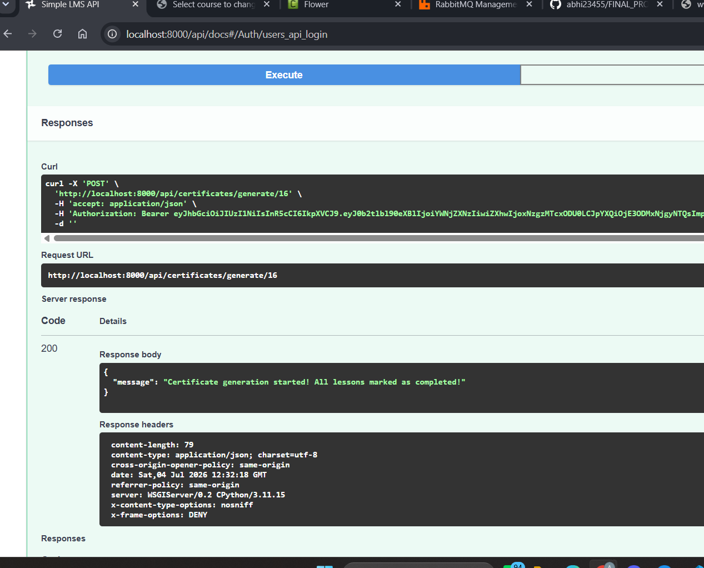

- 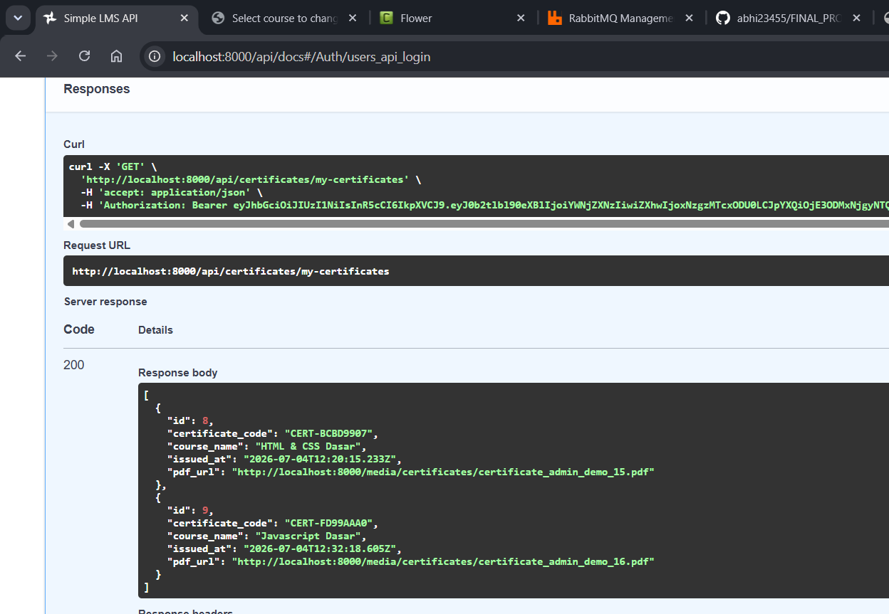

- 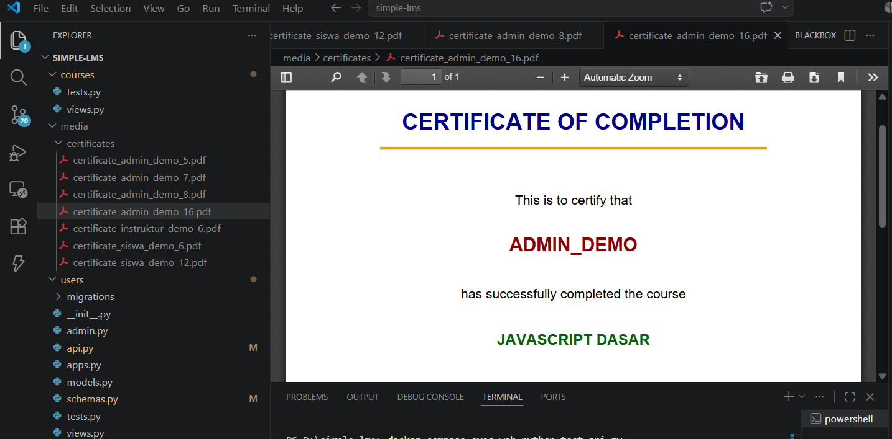

- 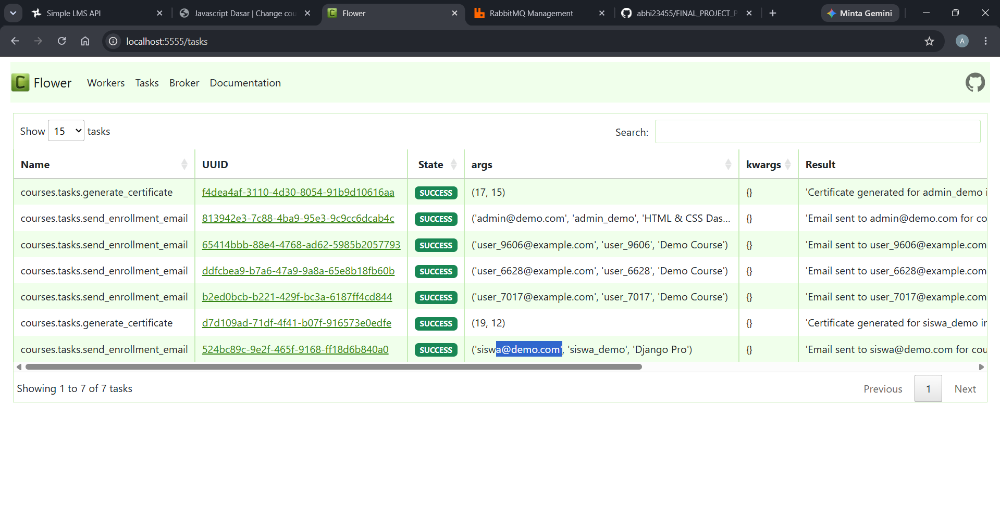

- 

- 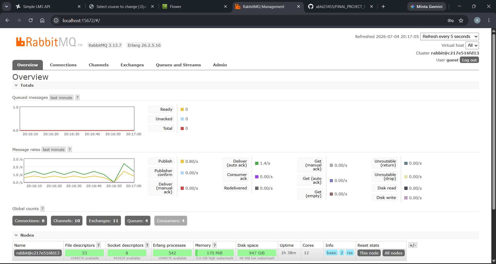

- 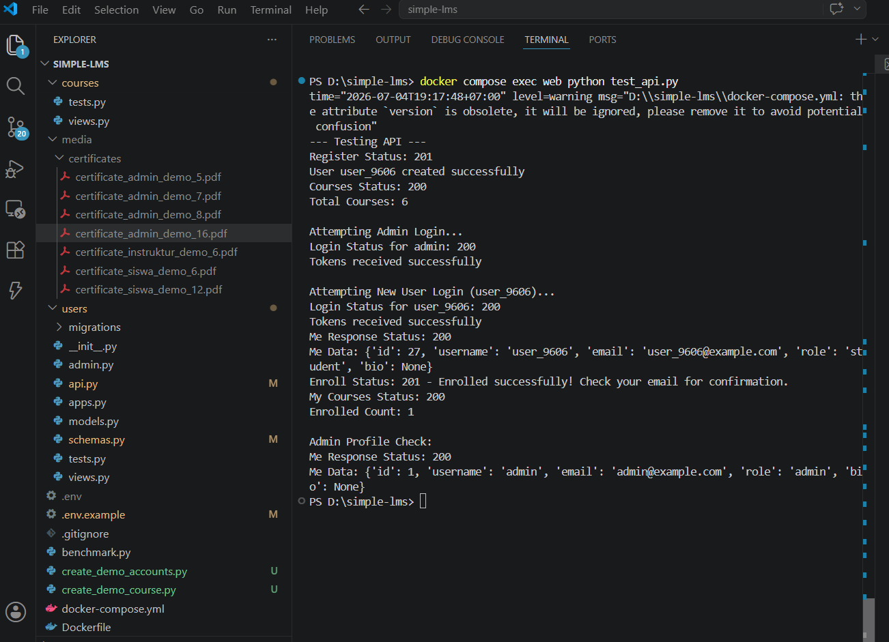

- 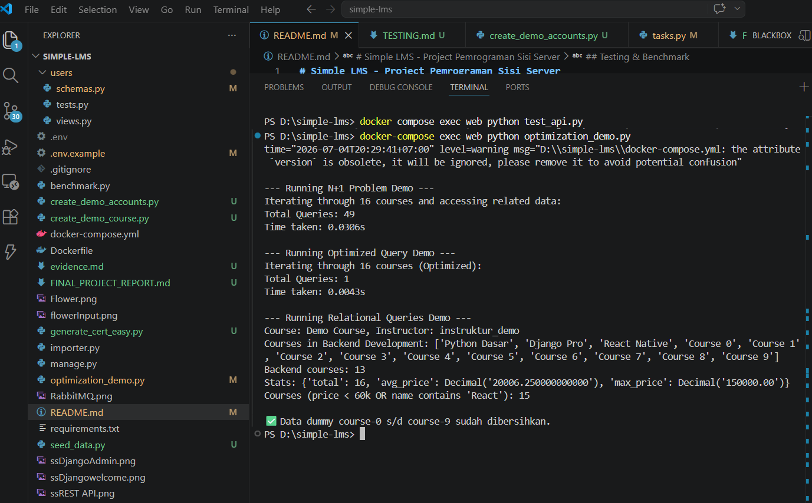

- 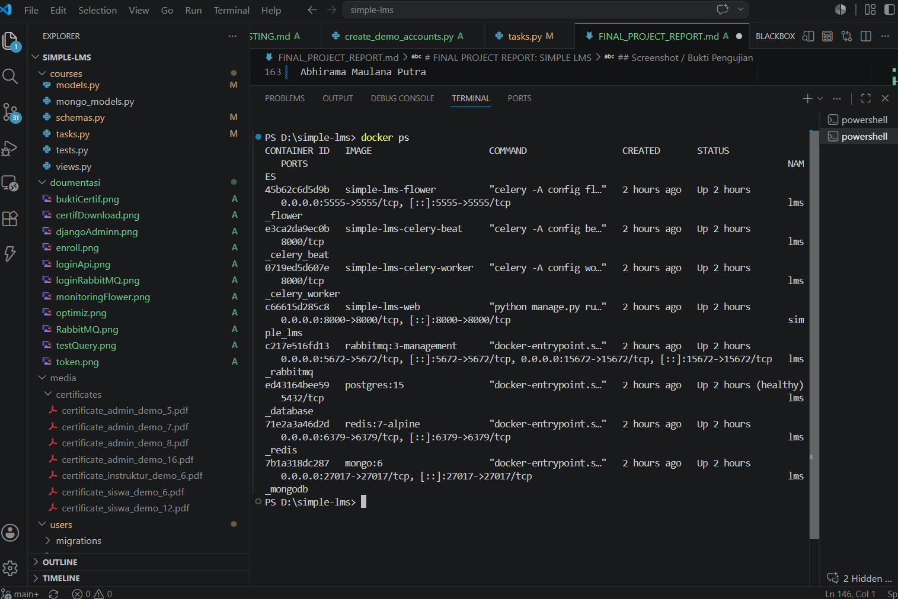


---

## Kendala dan Solusi
1) Swagger UI tidak bisa memuat OpenAPI schema karena `NinjaAPI` awalnya dikonfigurasi dengan `auth=JWTAuth()` sehingga `openapi.json` mengembalikan 401. Solusi: set `NinjaAPI(..., auth=None)` dan lindungi router yang perlu auth secara individual.
2) ImportError pada startup: `users/api.py` berisi import model yang salah sehingga Django gagal. Solusi: perbaiki `users/api.py` (restore/implement auth router) dan pastikan import-model sesuai.
3) Login endpoint awal menerima query params, sedangkan klien mengirim JSON — menyebabkan status 422. Solusi: tambahkan `LoginSchema` dan terima JSON body, kembalikan token JWT menggunakan `ninja_jwt.tokens.RefreshToken`.
4) Celery worker awal butuh flag events (`-E`) untuk monitoring task; diperbaiki di `docker-compose.yml` dan restart container.

---

## Kesimpulan
Proyek ini berhasil mengimplementasikan Paket 4 (Performance & API Quality) secara lengkap: caching Redis, invalidasi cache, perbaikan query untuk menghindari N+1, filtering/sorting/pagination lengkap, dan format response konsisten. Selama pengerjaan, beberapa issue operasional (swagger protected schema, import error, login payload) ditemukan dan diperbaiki. Pengalaman ini memperkuat pemahaman tentang integrasi caching, async processing, dan desain API yang baik.

---

## Author
Abhirama Maulana Putra