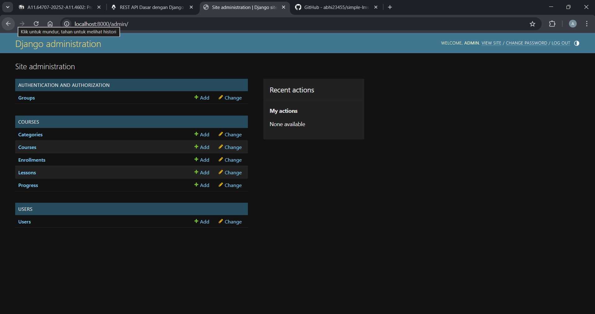
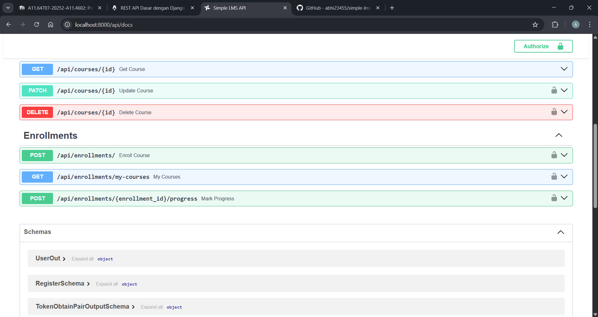
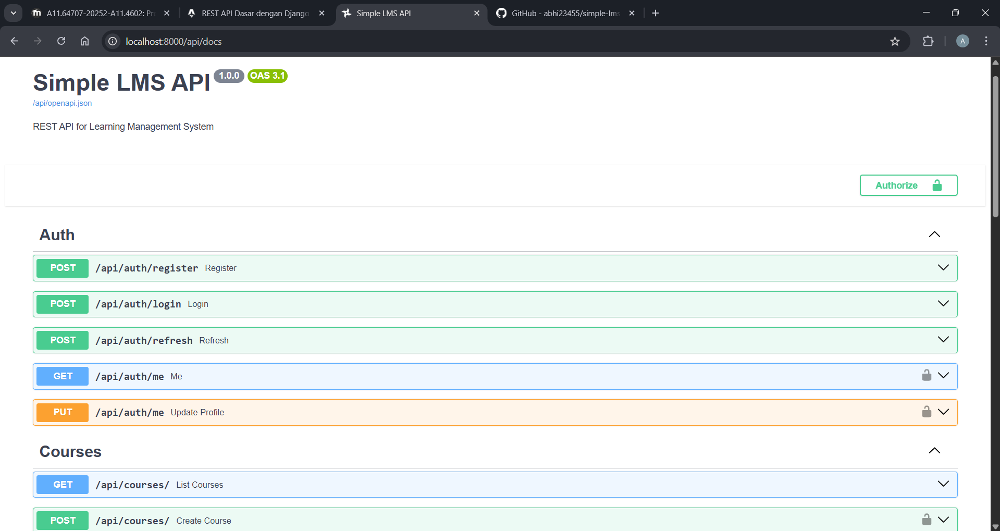
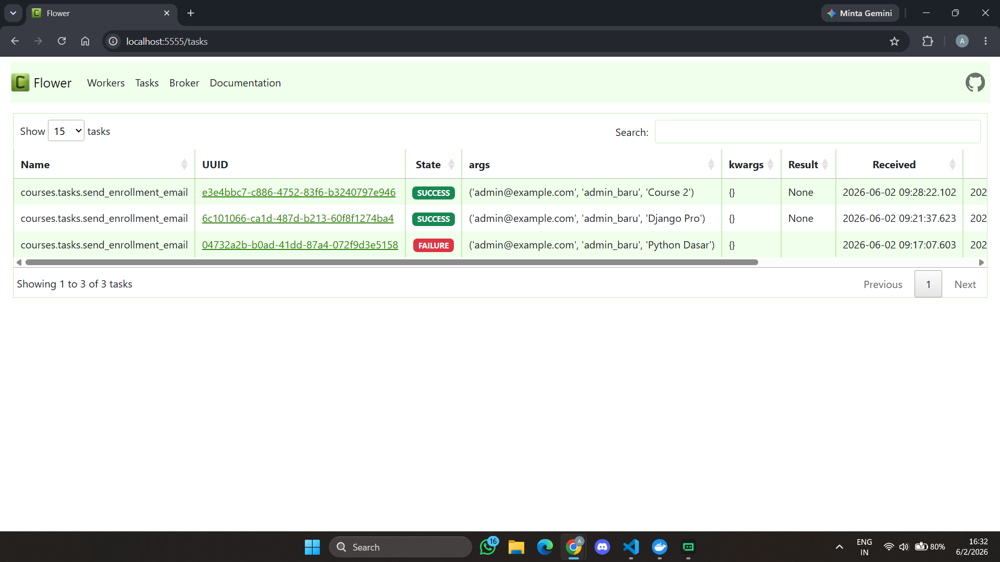
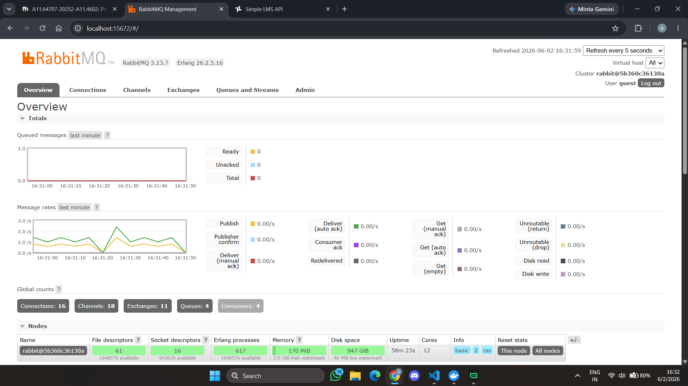

# Simple LMS - Project Pemrograman Sisi Server

Proyek Simple Learning Management System (LMS) berbasis Django & Django Ninja dengan arsitektur backend modern.

---

## Prasyarat
- [Docker](https://www.docker.com/)
- [Docker Compose](https://docs.docker.com/compose/)

---

## Struktur Proyek
```text
simple-lms/
├── config/                 # Konfigurasi utama Django
├── courses/                # Aplikasi manajemen kursus
├── users/                  # Aplikasi manajemen user
├── .env.example            # Contoh environment variables
├── create_demo_accounts.py # Script buat akun demo
├── docker-compose.yml      # Definisi seluruh layanan
├── Dockerfile              # Dockerfile web app
├── requirements.txt        # Dependencies Python
├── README.md               # Dokumentasi ini
└── FINAL_PROJECT_REPORT.md # Laporan Final Project
```

---

## Fitur Utama

### 1. Fondasi Dasar (Komponen Wajib)
- ✅ Docker & Docker Compose
- ✅ PostgreSQL Database
- ✅ Custom User Model (admin, instructor, student)
- ✅ JWT Authentication
- ✅ Role-Based Access Control (RBAC)
- ✅ REST API dengan Django Ninja
- ✅ Swagger/OpenAPI Documentation
- ✅ Django Admin Panel

### 2. Fitur Tambahan (Performance & Analytics)
- ✅ **Redis Caching**: Course list & detail cache untuk kecepatan tinggi
- ✅ **Rate Limiting**: Batas request untuk keamanan
- ✅ **MongoDB**: Activity log & Learning Analytics
- ✅ **Celery + RabbitMQ**: Async task processing (email, laporan)
- ✅ **Flower**: Monitoring Celery task
- ✅ **Optimasi Query**: Fix N+1, select_related, prefetch_related

---

## Cara Menjalankan Project
1. **Jalankan seluruh layanan**:
   ```bash
   docker-compose up -d --build
   ```
2. **Jalankan migrasi database**:
   ```bash
   docker-compose exec web python manage.py migrate
   ```
3. **Buat akun demo**:
   ```bash
   docker-compose exec web python create_demo_accounts.py
   ```

---

## URL yang Dapat Diakses
| Layanan | URL | Keterangan |
|---------|-----|------------|
| API Docs (Swagger) | http://localhost:8000/api/docs | Dokumentasi dan uji coba API |
| Django Admin | http://localhost:8000/admin | Panel admin Django |
| Flower (Celery Monitor) | http://localhost:5555 | Monitoring task async |
| RabbitMQ Management | http://localhost:15672 | (guest/guest) Monitor antrian pesan |

---

## Akun Demo
| Role | Username | Password |
|------|----------|----------|
| Admin | `admin_demo` | `admin123` |
| Instructor | `instruktur_demo` | `instruktur123` |
| Student | `siswa_demo` | `siswa123` |

---

## Endpoint Penting
### Auth
| Metode | Path | Deskripsi | Auth Dibutuhkan |
|--------|------|-----------|-----------------|
| POST | `/api/auth/register` | Registrasi user baru | ❌ |
| POST | `/api/auth/login` | Login dapatkan token JWT | ❌ |
| GET | `/api/auth/me` | Dapatkan informasi user saat ini | ✅ |

### Courses
| Metode | Path | Deskripsi | Auth Dibutuhkan |
|--------|------|-----------|-----------------|
| GET | `/api/courses/` | Daftar course (public) | ❌ |
| GET | `/api/courses/{id}` | Detail course beserta lesson | ❌ |
| POST | `/api/courses/` | Buat course baru | Instructor |

### Enrollments
| Metode | Path | Deskripsi | Auth Dibutuhkan |
|--------|------|-----------|-----------------|
| POST | `/api/enrollments/` | Enroll ke course | Student |

### Analytics & Reports
| Metode | Path | Deskripsi | Auth Dibutuhkan |
|--------|------|-----------|-----------------|
| GET | `/api/analytics/logs/user/{user_id}` | Lihat log aktivitas user | Admin |
| GET | `/api/analytics/stats/course/{course_id}` | Statistik course | Admin/Instructor |

---

## Testing & Benchmark
- **Benchmark Speed**: `docker-compose exec web python benchmark.py`
- **Demo Optimasi**: `docker-compose exec web python optimization_demo.py`

---

## Deliverables Final Project
✅ `docker-compose.yml` dan `Dockerfile`  
✅ `FINAL_PROJECT_REPORT.md`  
✅ `create_demo_accounts.py` (script buat akun demo)  
✅ `.env.example`  
✅ README.md lengkap  
✅ Dokumentasi Swagger  
✅ Screenshot demo  

---

## Screenshot
- 
- 
- 
- 
- 
- 

---

## Author
Abhirama Maulana Putra
